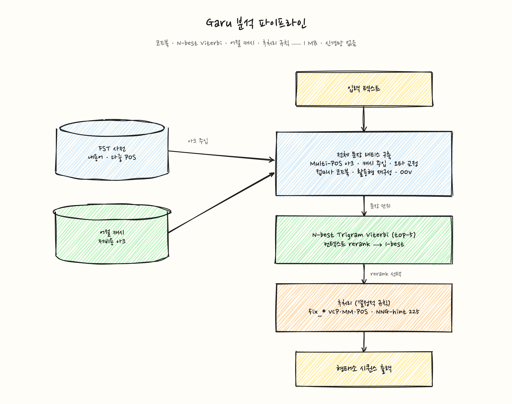

# 가루 (Garu)

**세계에서 가장 가벼운(1MB) 브라우저 네이티브 한국어 형태소 분석기.**

기존 한국어 형태소 분석기는 대부분 수십 MB의 모델을 서버나 네이티브 런타임으로 구동하는 것을 전제로 합니다. Garu는 **1MB 모델과 337KB WASM 엔진**만으로 브라우저에서 직접 실행되며, 서버 통신 없이 완전한 오프라인 형태소 분석을 수행합니다.

---

## 특징

- **초경량 브라우저 실행** -- 1MB 모델로 브라우저에서 바로 동작하는 유일한 한국어 형태소 분석기 (수십 MB 모델 불필요)
- **초경량** -- 1MB 코드북 모델, 337KB WASM (npm 패키지에 포함)
- **높은 정확도** -- F1 93.7% (9,000문장 v15k 골드 테스트셋, ep_norm 정규화), NIKL MP F1 93.7%
- **서버 불필요** -- WebAssembly로 클라이언트에서 직접 실행
- **결정적** -- 코드북 + 문장 N-best Trigram Viterbi + 컨텍스트 규칙 POS 보정 (신경망 없음)
- **오프라인 지원** -- 네트워크 없이도 완전한 형태소 분석 가능
- **[라이브 데모](https://garu.zerry.co.kr)** -- 브라우저에서 바로 체험

---

## 왜 Garu인가?

기존 형태소 분석기는 수십 MB의 모델을 서버·네이티브 환경에서 구동하는 경우가 많습니다. Garu는 **1MB 모델을 npm에 번들**해 별도 다운로드 없이 브라우저에서 바로 실행되는 초경량 한국어 형태소 분석기입니다.

|  | 서버 기반 분석기 | Garu |
|---|---|---|
| 모델 크기 | 수십 MB | **1MB** (+337KB WASM) |
| 실행 환경 | 서버/네이티브 | **브라우저 (WASM)** |
| 모델 번들 | 별도 로드 | **npm에 포함** |
| 네트워크 | 필요 (API 호출) | **불필요 (오프라인)** |
| 모바일 웹 | 비실용적 | **지원** |

> **정확도**: 9,000문장 v15k 골드 테스트셋 F1 93.7% (ep_norm 정규화 기준), NIKL MP F1 93.7%. 서버 기반 분석기와 다른 설계 목표(경량·브라우저)를 가지므로 단순 수치 비교보다는 사용 환경에 맞는 선택을 권장합니다.

---

## Quick Start

```bash
npm install garu-ko
```

```typescript
import { Garu } from 'garu-ko';

// 모델 로드 (npm 패키지에 포함되어 별도 다운로드 불필요)
const garu = await Garu.load();

// 형태소 분석
const result = garu.analyze('배가 아파서 약을 먹었다');
console.log(result.tokens);
// [
//   { text: '배',   pos: 'NNG', start: 0, end: 2 },
//   { text: '가',   pos: 'JKS', start: 0, end: 2 },
//   { text: '아프', pos: 'VA',  start: 3, end: 6 },
//   { text: '어서', pos: 'EC',  start: 3, end: 6 },
//   { text: '약',   pos: 'NNG', start: 7, end: 9 },
//   { text: '을',   pos: 'JKO', start: 7, end: 9 },
//   { text: '먹',   pos: 'VV',  start: 10, end: 13 },
//   { text: '었',   pos: 'EP',  start: 10, end: 13 },
//   { text: '다',   pos: 'EF',  start: 10, end: 13 },
// ]

// 간단 토큰화 (표면형만)
const tokens = garu.tokenize('나는 학교에 간다');
console.log(tokens);
// ['나', '는', '학교', '에', '간다']

// 리소스 해제
garu.destroy();
```

### 커스텀 모델 로드

```typescript
// 커스텀 URL에서 모델 로드
const garu = await Garu.load({ modelUrl: '/my-models/custom.gmdl' });

// ArrayBuffer로 직접 전달
const response = await fetch('/my-models/custom.gmdl');
const modelData = await response.arrayBuffer();
const garu = await Garu.load({ modelData });
```

---

## 아키텍처



코드북 + 어절 캐시 + 문장 수준 N-best Trigram Viterbi 구조에 결정적 후처리 규칙을 결합한 경량 분석기입니다.

전체 문장에 대해 래티스를 구축하고, 어절 캐시 항목을 저비용 후보 아크로 주입한 뒤 문장 수준 Viterbi 디코딩(top-5)을 수행합니다. 컨텍스트 rerank 보너스로 N-best 중 최적을 선택하고, 마지막으로 결정적 POS 보정 규칙(시간 부사 "오늘/지금"→MAG, 의문대명사 "뭐+VV"→NP 등)과 NNG-hint 사전(NIKL gold에서 NNG 비율 ≥ 95% 단어 225개)을 적용합니다.

코드북 데이터는 모두의 말뭉치(NIKL MP) 골드 어노테이션과 Kiwi 분석기 출력의 하이브리드로 추출합니다. 결정 규칙과 어절 캐시 확장 패턴은 5K 골드/NIKL 코퍼스에서 마이닝된 사례를 기반으로 합니다. 자세한 연구 경과는 [기술 논문](docs/paper.md)과 [CHANGELOG](js/CHANGELOG.md)를 참고하세요.

---

## API Reference

### `Garu.load(options?): Promise<Garu>`

WASM 모듈을 초기화하고 모델을 로드합니다.

| Option | Type | Description |
|---|---|---|
| `modelData` | `ArrayBuffer` | 모델 바이트를 직접 전달 |
| `modelUrl` | `string` | 커스텀 URL에서 모델 로드 |

옵션을 지정하지 않으면 npm 패키지에 포함된 기본 모델을 로드합니다.

### `garu.analyze(text, options?): AnalyzeResult | AnalyzeResult[]`

형태소 분석을 수행합니다.

- `text` -- 분석할 한국어 텍스트
- `options.topN` -- 1보다 크면 N-best 결과를 배열로 반환 (아직 완전히 지원되지 않으며, 결과가 더 적을 수 있음)

```typescript
interface AnalyzeResult {
  tokens: Token[];  // 형태소 토큰 배열
  score: number;    // 디코더 경로 점수
  elapsed: number;  // 처리 시간 (밀리초)
}

interface Token {
  text: string;     // 표면형
  pos: POS;         // 품사 태그 (세종 태그셋)
  start: number;    // 어절 시작 오프셋 (글자 단위)
  end: number;      // 어절 끝 오프셋 (글자 단위)
}
```

### `garu.nouns(text, options?): string[]`

텍스트에서 명사(NNG, NNP)만 추출합니다. `options.includeSL`을 켜면 `"AI"`, `"BM25"` 같은 외래어 토큰(SL)도 함께 포함합니다.

```typescript
garu.nouns('인공지능 기술이 발전했다');
// ["인공", "지능", "기술", "발전"]

garu.nouns('AI 기술이 발전했다', { includeSL: true });
// ["AI", "기술", "발전"]
```

### `garu.tokenize(text): string[]`

표면형 문자열 배열을 반환합니다. 분절된 텍스트만 필요할 때 `analyze()`의 경량 대안으로 사용합니다.

### `garu.isLoaded(): boolean`

WASM 분석기가 초기화되어 사용 가능한 상태이면 `true`를 반환합니다.

### `garu.modelInfo(): ModelInfo`

로드된 모델의 메타데이터를 반환합니다.

```typescript
interface ModelInfo {
  version: string;  // 모델 버전
  size: number;     // 모델 크기 (바이트)
  accuracy: number; // 보고된 정확도 (0.937)
}
```

### `garu.destroy(): void`

WASM 인스턴스를 해제하고 메모리를 반환합니다. 호출 후 인스턴스를 재사용할 수 없습니다.

---

## 통합 패키지

기존 JS 검색 라이브러리에 가루의 한국어 형태소 토큰화를 바로 끼울 수 있는 어댑터입니다.

- **[`garu-orama-tokenizer`](https://www.npmjs.com/package/garu-orama-tokenizer)** — [Orama](https://github.com/oramasearch/orama) 검색 엔진용 한국어 토크나이저
- **[`garu-minisearch-tokenizer`](https://www.npmjs.com/package/garu-minisearch-tokenizer)** — [MiniSearch](https://github.com/lucaong/minisearch) 검색 엔진용 한국어 토크나이저

기본 토크나이저로는 `"먹었다"`가 `"먹는다"`와 매치되지 않고, `"학교"` 검색이 `"학교에/를/가"`를 놓치는 문제를 해결합니다. 조사/어미를 떼고 어간만 색인하므로 활용형이 달라도 같은 단어로 잡힙니다.

```ts
// Orama 예시
import { create, insert, search } from '@orama/orama'
import { createTokenizer } from 'garu-orama-tokenizer'

const db = await create({
  schema: { title: 'string' },
  components: { tokenizer: await createTokenizer() }
})
await insert(db, { title: '학교에서 점심을 먹었다' })

await search(db, { term: '먹다' })  // ← 매치됨
```

---

## 개발 가이드

### 요구 사항

- Rust toolchain (stable)
- `wasm-pack`
- Node.js >= 18
- Python >= 3.10 (학습 파이프라인용)

### 프로젝트 구조

```
crates/
  garu-core/     # Rust 코어: Codebook 분석기, FST 사전, 모델 로더
  garu-wasm/     # WASM 바인딩 (wasm-bindgen)
  garu-tools/    # CLI 도구 (FST 빌더)
js/              # TypeScript API 래퍼 (npm 패키지)
  models/        # 번들된 모델 파일 (base.gmdl)
  pkg/           # WASM 빌드 출력
training/        # 코드북 추출/빌드 파이프라인 (Python)
models/          # 컴파일된 모델 파일 (.gmdl)
docs/            # 기술 문서
```

### 빌드

```bash
# Rust 코어 라이브러리 빌드
cargo build --release

# WASM 패키지 빌드
wasm-pack build crates/garu-wasm --target web --out-dir ../../js/pkg

# TypeScript 래퍼 빌드
cd js && npx tsc

# 전체 빌드
cd js && npm run build
```

### 테스트

```bash
# Rust 테스트
cargo test

# JS/TS 테스트
cd js && npm test
```

---

## 기술 문서

아키텍처와 설계 결정에 대한 상세한 내용은 [기술 논문](docs/paper.md)을 참고하세요.

---

## 데이터 출처

이 프로젝트의 형태소 분석 모델은 다음 데이터를 기반으로 학습되었습니다:

- **모두의 말뭉치 형태 분석 말뭉치(v1.1)** — 국립국어원(National Institute of Korean Language) 제공. 모델에는 원본 텍스트가 포함되지 않으며, 빈도 통계 및 패턴만 사용됩니다.
- **세종 태그셋** — 42개 품사 태그 체계

## 라이선스

MIT
